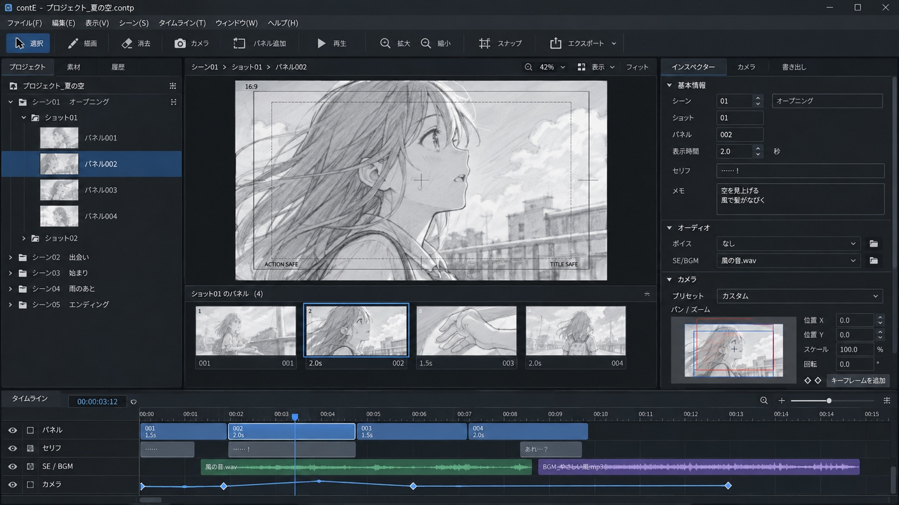

# contE — 次期開発引き継ぎ資料

更新日：2026-09-14。初期実装 `8b928b0` を基準に作成し、P0〜P5の実装後に状態を更新した。ブラウザで動く範囲（P0保存・復旧／P1描画とPanel操作／P2 TimelineとCamera／P3音／P4紙コンテ／P5 Animatic出力）は実装と検証を終えている。**Windowsデスクトップ化だけは実機が無いため未着手**で、判断基準と調査は[DESKTOP.md](DESKTOP.md)にまとめた。これは完成報告ではなく、次の担当者への引き継ぎ資料である。

## 1. 目的と判断基準

「絵コンテを考える速度をソフトが邪魔しないこと」を最優先する。最終目標は **描く → Panel追加 → 尺調整 → Camera設定 → 音配置 → 再生 → 紙コンテ / PDF / Animatic出力** の一貫した制作環境。

機能数より、操作数・視線移動・待ち時間・誤操作・復旧の確実さで判断する。一度に全機能を実装せず、下記の段階ごとに実装と検証を完結させる。

## 2. 添付された完成UI目安



[添付画像を原寸で開く](references/target-ui.jpeg)。元ファイル名：`FAD94FF7-438C-4A92-8D17-9CBA513825AF.jpeg`。原本を加工せず収録した。これはユーザーが指定した目標画像であり、現行アプリのスクリーンショットではない。

| 画像の要素 | contEでの設計指針 | 現状との差 |
|---|---|---|
| 左のScene/Shot/Panelツリー | 構成の把握と移動。選択を全ビューで同期 | Scene/Shot名編集・自動スクロール・折りたたみ状態の保持を実装。パネルとして閉じられる |
| 中央の大きな描画面 | 描画を主役にし、タイミング編集と往復しない | ブラシ/消しゴム/筆圧/ズーム/パン/画像取り込みを実装。レイヤー・図形・カラーは未実装 |
| 描画面下のPanel一覧 | 前後の絵を比較しながら連続追加 | 範囲選択とドラッグ順序変更を実装。要らないときは閉じられる。複数Shotの横断表示は未実装 |
| 下部Timeline | Panel・台詞・音・Cameraの時間関係を一望 | fps目盛・選択範囲・Camera・音声3トラックを実装。トラックの折りたたみは未実装 |
| 右Inspector/Camera/書き出し | 選択内容に応じた低頻度設定の収納 | タブ化と可変幅を実装。タブは1枚ずつ閉じられ、開閉と幅は次回の起動でも保たれる。書き出し（紙コンテ・Animatic）は中央のタブへ移し、設定はプロジェクトへ保存 |
| 音声波形とCameraキー | 同一時刻で再生・スクラブ・書き出し | Cameraキー・音声クリップとも編集可。波形はキャッシュして表示。書き出しは再生と同じ評価を使う |

画像に含まれるイラストは参考資料の一部として保持し、アプリの初期素材や自作アセットとして流用しない。画面の比率と情報の関係を参考にし、装飾を機械的に模写しない。

## 3. 現在できること・できないこと

| 領域 | 実装済み | 未完了・制約 |
|---|---|---|
| 基盤 | Nodeで起動する依存不要のローカルWebアプリ | Windowsデスクトップ配布はまだない（[DESKTOP.md](DESKTOP.md)） |
| 画面 | AE風のパネル式UI。左（プロジェクト）・中央（コンポジション / 紙コンテ / Animatic）・右（内容・Camera・音・マーカー・構成・ショートカット）・下（タイムライン）。タブの×かウィンドウメニューで開閉し、`~`で最大化、作業レイアウトを3つ用意。開閉と幅・高さは次回の起動でも保たれる | パネルのドック間移動、複数ウィンドウ |
| Model | Scene/Shot/Panel、整数フレーム、v5検証、v1→v5 Migration、Asset参照、ストローク属性、Panel移動、音声クリップ、紙面設定 | fps変更UI、レイヤー、テンプレート |
| 編集 | Panel追加/複製/複数選択/Shift範囲選択/ドラッグ順序変更（Shot・Sceneをまたぐ移動を含む）/削除、Shot分割/統合、Scene・Shot名編集、コピー&ペースト、台詞・注記の検索 | テンプレート |
| 描画 | Canvasの線、ブラシ太さ、消しゴム、筆圧、ズーム/パン、画像取り込み、表示範囲でのサムネイル描画 | レイヤー、図形・テキスト、選択範囲の変形、カラー |
| Timeline | Timeline Engine（範囲・目盛・スナップ・Zoom・追従）、端ドラッグのリップル尺変更、スクラブ、選択範囲表示、Camera・台詞/SE/BGMトラック、波形表示 | Panelクリップのドラッグ移動、トラックの折りたたみ |
| Camera | 任意時刻のキー追加/移動/削除、キー間の線形補間、紙・再生・Inspectorで共有する要約 | イージング、Canvas上での直接操作、キーのコピー |
| 保存/復旧 | .contp JSONのダウンロード/読み込み、IndexedDBへの自動保存と起動時の復旧、保存状態表示、80段階のUndo/Redoと選択状態の復元 | ファイルへの直接上書き、素材の同梱書き出し、Worker化した保存 |
| 紙コンテ | 用紙A4/A3/B4/Letterと向き、列の順番・個別幅・表示、コマ数・余白・文字サイズ・ヘッダー/フッター、長文の続き行、全キーを通るCamera軌道 | 文字が主体のPDF（現状は画像ベース）、テンプレート保存、行ごとの高さ可変 |
| 出力 | 紙コンテ（PNG連番ZIP・印刷/PDF・進捗と中止）、Animatic（音つきWebMの実時間録画、フレーム厳密なPNG連番ZIP）。どちらも中央のタブで、紙面は編集に追従する | 文字埋め込みPDF、実時間より速いオフライン動画書き出し、H.264等の選択 |

Inspectorの「SE / BGM（注記）」欄は文字注記で、音声クリップとは別のデータ（紙コンテでは両方を出す）。ブラウザ再生は動画ファイル書き出しではない。現在のUIを完成画像と同等と扱わない。自動保存はブラウザのIndexedDBであり、OS上のファイルへは「ファイル」メニューから別途書き出す必要がある。

## 4. 次に行う順番と完了条件

### P0 — 保存・復旧とデータ基盤（2026-09-13 実装済み）

1. ✅ `ProjectRepository`（`src/repository.js`）へ保存・読み込み・復旧・素材入出力を集約。UIは永続化の詳細を持たない。`src/storage.js`にIndexedDBとメモリの2実装を置き、テストはメモリ実装で動く。
2. ✅ IndexedDBへ最大8世代のスナップショットを保持。変更から0.6秒（連続編集中は最長4秒）で遅延保存し、ヘッダーに「未保存の変更 / 自動保存中 / ブラウザに保存 時刻 / 失敗」を表示する。失敗は失敗として表示し、未保存のまま次の編集で再試行する。
3. ✅ 起動時に復旧候補の日時・名前・Panel数・保存種別を提示し、復旧か破棄を選べる。破棄しても保存データは消さない。読めない保存は削除せず読み飛ばし、直前の正常な世代を提示する。
4. ✅ `Asset` IDとバイナリを分離。プロジェクトは`assets`のメタデータと`panel.image`の参照のみを持ち、バイナリはRepositoryの別ストアにある。履歴は素材を複製しない。v1→v2 Migrationを先に用意した。
5. ✅ 履歴は編集コマンド単位で選択状態も保存し、Undo/Redoで選択と再生ヘッドが戻る。無変更・無効操作（Shot先頭での分割など）はUndo段数もRedoも消費しない。

完了条件の確認：500 Panelを自動保存→再読込→復旧し、Panel数・タイトル・尺・描画が一致することをブラウザ検証で確認（`npm run test:browser`）。不正JSON・未知Version・容量不足・保存中の再編集はテスト済み（`tests/repository.test.js`）。旧v1 fixtureの読込は`tests/migration.test.js`。

残件：ファイルへの直接上書き保存、素材を含む書き出し、保存処理のWorker化、複数プロジェクトの管理UI。

### P1 — 描画とPanel操作を実用水準へ（2026-09-13 実装済み）

- ✅ 画像ファイルをPanelへ取り込む。縦横比を保ってコマ枠へ収め、濃さを0〜100%で調整できる。原本のファイルはAssetストアへ保存し、表示用のビットマップだけ長辺2048pxへ縮小する。プロジェクトJSONはIDとメタデータ（名前・MIME・バイト数・元の画素数）だけを持つ。
- ✅ ブラシ太さ、消しゴム、筆圧（ペン入力時のみ。マウス/タッチは一定）、ホイールのズームとAlt/中ボタンドラッグのパンをDrawing Adapterへ実装。消しゴムは別面で合成するので、紙コンテやPNGに穴を開けない。描画も画像も尺変更と同じ履歴に乗る。
- ✅ Shift範囲選択（全体順序基準）、Stripのドラッグ順序変更（`movePanels`でShot/Sceneをまたぐ移動も可能）、Scene/Shot名編集（ツリーのダブルクリックとInspectorの構成タブ）、選択が変わったときだけ働く自動スクロール。
- ✅ 4つのペインの境界をドラッグでき、幅/高さはRepositoryのmetaストアへ保存して次回起動で復元する。Inspectorは内容 / Camera / 構成のタブに分けた。

完了条件の確認：ブラウザ検証で、描画→消しゴム→範囲選択→ドラッグ並べ替え→Undoの往復、画像取り込み後の再起動と復旧、ペイン幅の復元を確認した（`npm run test:browser`）。ドラッグは中断（pointercancel）で順序も描画も変えずに戻す。Undoは選択Panelと再生位置も戻す。

残件：レイヤー、図形/テキスト、カラー、選択範囲の変形、Panelのコピー&ペースト、Timeline上でのドラッグ移動。

### P2 — Timeline EngineとCamera Track（2026-09-14 実装済み）

- ✅ `src/timeline.js`へTimeline Engineを分離。px/frameの段階、表示範囲の絞り込み、目盛、スナップ候補と吸着、Zoomアンカー、再生ヘッド追従、選択範囲をDOMなしの関数として持つ。`src/app.js`はEngineの結果を描くだけになった。
- ✅ fps基準の目盛（ラベルが重ならない間隔を自動選択）、選択範囲の帯と「選択 n Panel · Xf / Ys」表示、再生ヘッド追従（ON/OFF可）、カーソル基準のホイールZoomと再生ヘッド基準のスライダーZoom、全体表示（F）。スナップはPanel境界・秒・再生ヘッドが対象で、Altで一時解除できる。
- ✅ CameraキーはPanel内の任意時刻で追加（K／レーンのダブルクリック）・移動（ドラッグ）・削除（Delete）できる。**尺変更時の規則**：キーは尺に対する比率tで保持し、尺を変えるとCameraの動きも同じ比率で伸縮する（Inspectorとレーンにはフレーム位置で表示）。再生・紙コンテ・Inspectorは`cameraAt`と`describeCamera`を共有する。
- ✅ Pan/Tilt/Zoom/Rotation/HOLDをInspectorの要約、Timelineレーン、紙コンテの開始枠（実線）・終了枠（破線）・全キーを通る軌道・矢印・中間キー・キー位置（フレーム）で確認できる。

完了条件の確認：500 Panelで画面外のクリップを生成せず（40個未満）、全体表示・スクロール・Zoomが破綻しないことをブラウザ検証で確認。境界スクラブは47f→「1s : 23f」、48f→「2s : 00f」で次Panelの先頭に入る（スナップONでは48fへ吸着）。尺変更・Shot分割・Undoの前後でCameraキーと`cameraAt`の値が一致することを単体テストで確認した。

残件：クリップのドラッグ移動、イージング、Canvas上でのCamera直接操作、音声/台詞トラック（P3）。

### P3 — 音配置・波形・同期再生（2026-09-14 実装済み）

- ✅ 音声クリップは`{assetId, track: dialogue|se|bgm, anchor, at, frames, offset, gain}`。**位置の規則**：クリップは開始位置のPanelに属し、そのPanelからの相対位置で持つ。前のPanelの尺が変わればクリップも同じだけ動き、Panelを消せばクリップも消える（Undoで一緒に戻る）。台詞テキストはPanelの欄のまま、音声クリップとは別データとして扱い、紙コンテでは両方を出す。
- ✅ デコード結果と波形ピークを`AudioEngine`がキャッシュする。波形は素材と列数の組み合わせごとに1度だけ計算し、スクロールのたびに作り直さない。
- ✅ 再生は音声時計（`AudioContext.currentTime`）を基準にし、音が無いときだけ表示用の時計へ落ちる。再生のたびに前の予約を必ず止めるので、連打やseekで二重に鳴らない。停止時は音を残さない。
- ✅ 紙コンテの音注記は`soundNotes`が時間の重なりから作る（またいだPanelには「（続き）」、途中から始まる音には「+12f」）。注記欄の文字と合わせて1行にする。
- ✅ 素材が見つからないクリップは赤く表示し、「音」タブから同じIDへ別ファイルを入れて差し替えられる。

完了条件の確認：ブラウザ検証で、3秒のWAVを置いて波形表示・ドラッグ移動・Panel削除で音も消えることとUndoでの復帰を確認。再生ボタンを連打してから4秒再生し、実時間に対するずれは**−2フレーム（約83ms、60msの予約リードを含む）**だった。数値は`npm run test:browser`の`sync`に出力される。

残件：フェード/ボリューム曲線、複数チャンネルのミックス、音の波形からの自動尺合わせ、書き出し時の音声（P5）。

### P4 — 紙コンテを本番出力へ（2026-09-14 実装済み）

- ✅ 紙面設定を`project.paper`としてモデル化（v4→v5 Migration）。用紙A4/A3/B4/Letter、縦横、コマ数、余白、文字サイズ、ヘッダー/フッター、列の順番・個別幅・表示/非表示、尺・階層番号・Camera作画の各スイッチを持つ。設定変更は履歴にも自動保存にも乗る。
- ✅ 長文は切り捨てない。列ごとに折り返した行を行高で分け、入り切らない分を次の行・次のページへ送り、CUT列に「（続き）」を添える。文字数が保たれることを単体テストで確認する。
- ✅ Paper Renderer（`src/paper.js`：用紙・列・折り返し・続き行・Camera表記）とExporter（`src/exporter.js`：ページ単位の進捗・中止・ZIP）を分離。プレビューは表示中のページだけを描き、全ページの同期走査をやめた。
- ✅ Camera表記はTimelineと同じキー列から生成。PANは横・TILTは縦の矢印、Zoomは開始枠（実線）と終了枠（破線）、中間キーは点、動きが無ければHOLD。キー位置はフレームで併記する。
- ✅ PNG連番は無圧縮ZIP（`src/exporter.js`の自前実装、追加ライブラリなし）1ファイルにまとめる。ZIPはPythonの`zipfile`で読めることを確認済み。

完了条件の確認：日本語長文・特殊記号（……！？＜＞＆「」〜①㈱♪）・1/4/8コマ・A4/A3・縦横・複数ページをブラウザ検証とプレビュー画像で確認し、文字落ちがないことを確かめた。500 Panel（125ページ）で初回プレビューは82ms、PNG書き出しは17/125ページ時点で中止でき、UIは固まらなかった。ヘッドレスChromiumの印刷では7 Panel→2ページのPDFが余白0で生成された。**WindowsのPDF保存と実印刷は環境が無いため未検証**。

残件：文字を埋め込むネイティブPDF、行ごとの高さ可変、テンプレート保存、Workerでの生成。

### P5 — Animatic出力（2026-09-14 実装済み）／Windowsデスクトップ化（未着手・実機待ち）

- ✅ 出力fps（8/12/24/30）と解像度（480p/720p/1080p）を選べる。映像は`animatic.evaluate`が`rowAtFrame`と`cameraAt`をそのまま呼ぶので、**再生・紙コンテ・動画が同じフレーム評価**を使う。音は`audio.scheduleFor`の同じ予約を録音用の出力先へ流す。
- ✅ 形式は2つ。**WebM（VP9/VP8＋Opus、音つき、実時間録画）**と、**PNG連番ZIP（フレーム厳密、音なし、外部エンコーダ用）**。対応形式は`MediaRecorder.isTypeSupported`で確認し、使えない環境ではその旨を表示してボタンを無効にする。
- ✅ 中止は両形式に対応。録画を中止した場合は録れていた分も捨て、半端なファイルを渡さない。出力はプロジェクトを一切書き換えないので、失敗しても素材と編集内容は元のまま。
- ⏳ Windowsのペン入力・ファイル上書き・音声・メモリの比較と、シェルの選定は**未着手**。実機が無いため測れない。判断基準・候補・測るべき項目・コーデックとライセンスの調査は[DESKTOP.md](DESKTOP.md)に用意した。

完了条件の確認：3分（90 Panel・4320フレーム・854×480・24fps）のプロジェクトの60秒地点に10秒の音を置き、実際にWebMを書き出して計測した。

| 項目 | 実測 |
|---|---|
| 書き出しにかかった実時間 | 180.2秒（実時間録画なので尺と同じ） |
| 出力ファイルの尺 | 180.09秒（プロジェクトは180.00秒。先頭に0.12秒の予約リードぶんが入る） |
| 音の位置 | 60.13秒〜70.08秒（プロジェクト上は60秒〜70秒） |
| ファイルサイズ | 1.09MB（VP9＋Opus） |
| 絵の一致 | Panelごとに線の本数を変えた素材で、0/1/2/3/4/45/89番目のPanelを再生位置から取り出し、すべて期待どおりの絵だった（45番目はCameraが動くPanel） |

**「通常権限のWindowsでインストール・起動・保存・出力が通る」は未検証**（Windows実機が無い）。

残件：実時間より速いオフライン書き出し（WebCodecsか外部エンコーダ）、H.264等の選択、音声のフェード/ミックス、デスクトップ化一式。

## 5. 責務分離の到達点

| 責務 | 現状 | 次の分離先/責任 |
|---|---|---|
| Project Model | model.js（schema・validation・migration・asset参照・履歴） | 素材メタの拡張、Project設定 |
| Project Repository | repository.js / storage.js（永続化・復旧・素材読み書き・自動保存） | 素材同梱の書き出し、保存のWorker化 |
| Timeline Engine | timeline.js（範囲・目盛・スナップ・Zoomアンカー・追従・選択範囲） | 音声トラックの区間計算、クリップ移動規則 |
| Playback Engine | playback.js / app.js | 時計・seek・表示更新、後に音声同期 |
| Drawing Engine Adapter | drawing.js（線・消しゴム・筆圧・画像・表示変換） | レイヤー合成、部分再描画 |
| Audio Engine | audio.js（クリップ解決・予約計算・decode/波形キャッシュ・音注記） | 複数チャンネルのミックス、書き出し時の同期 |
| Camera Animation | model.js（キー編集・補間・describeCameraをUI/紙/再生/動画で共有） | イージング、Canvas上での直接操作 |
| Paper Storyboard Renderer | paper.js（用紙・列レイアウト・折り返し・続き行・Camera表記） | 行高可変、テキストPDF |
| Exporter | exporter.js（進捗・中止・ZIP）／animatic.js（フレーム計画・評価・録画） | オフライン動画書き出し、Workerでの生成 |
| UI | app.js / index.html / style.css（ペインのリサイズと保存、Inspectorタブを実装） | Timeline UIの分離、コンテキストメニュー |

分離は各フェーズに必要な箇所から行う。未使用の抽象クラスを大量追加しない。

## 6. 検証と性能基準

既存コマンド：`npm test`、`npm run build`、`npm run bench`、任意環境で`npm run test:browser`。詳しい初期測定は[DEVELOPMENT.md](DEVELOPMENT.md)。モデルの0.12msという数値をUI全体の応答時間として報告しない。

| 評価 | 次回以降の方法 |
|---|---|
| Panel/Shot作成、尺変更 | 代表操作のクリック/キー操作数を記録 |
| Scene移動 | 5Scene×100Panelで選択から描画完了を測定 |
| 100/500 Panel | 空Panel・線画多め・実画像/音ありのfixtureを分ける |
| 再生開始 | コマンドから最初の表示/音まで。準備済み/初回を分ける |
| スクロール/Zoom | 入力から描画完了の中央値/p95とドロップフレーム（現状：500 Panelでscroll 17.7ms、zoom 33.3ms、Engine計算は0.01ms台） |
| 保存 | JSON化・素材書込み・保存完了を分け、サイズも記録（現状：500 Panel・筆圧つき線画のメモリ保存 中央値84.56ms、読込193.96ms、3.69MB。素材バイナリは別勘定） |
| Undo/Redo | 描画/尺/キー/削除/分割/統合の混合操作で往復一致 |
| 紙出力 | 操作数、初回プレビュー時間、全出力時間、最大メモリ（現状：500 Panelで初回プレビュー82ms、ページ割り計算 中央値2.51ms） |

目標値は実機基準で設定する。暫定目標は通常編集のp95を50ms以下、準備済み再生開始を100ms以下とする（達成保証ではない）。測定環境、サンプル数、素材条件、待機した描画フレーム数を必ず併記する。

各サイクルの終了時に「変更内容 / 変更理由 / 改善効果 / 残存問題 / 次に最も価値の高い改善」を記録する。テスト失敗や未検証事項を完成扱いしない。

## 7. 次の担当者への着手手順

1. この資料、README、ROADMAP、DEVELOPMENT、[DESKTOP.md](DESKTOP.md)、最新のmainと変更履歴を読む。
2. `npm test`・`npm run build`・`npm run bench`で開始時点を確認し、アプリを一通り操作する（描く→Panel→尺→Camera→音→再生→紙コンテ→Animatic）。
3. 次の主対象はWindowsデスクトップ化。**先にDESKTOP.mdの6項目を実機で測り、その数値でシェルを決める**。測る前にフレームワークを決めない。
4. シェルを決めたら、ファイルへの直接保存・素材同梱・クラッシュ復旧を先に移植する（`ProjectRepository`の役割をそのまま置き換える）。その後にオフライン動画書き出しへ進む。
5. 実装・測定・操作確認を行い、この資料の状態表と開発ノートを更新する。テストが落ちた状態や未検証の項目を完成扱いにしない。

## 付録A：元の依頼プロンプト全文

以下は初回依頼の本文。ツールの添付エラー文やシステム付加情報は含めない。

```text
@GitHub
あなたは映像制作ソフト、UI/UX、デスクトップアプリ、タイムライン編集に精通したシニアエンジニア兼プロダクトデザイナーです。

GitHub上の私のリポジトリを参照し、プロジェクト「contE」で作業を行い、高速で実用的な絵コンテ・アニマティック制作ソフトへ継続的に改善してください。

最初にリポジトリ全体を把握し、機能、データ構造、未完成部分、技術的負債、UX上の問題を確認してください。改善判断では、機能数ではなく「絵コンテを考える速度をソフトが邪魔しないこと」を最優先し、操作回数、視線移動、待ち時間、誤操作、復旧しやすさを重視してください。

目指すワークフローは、

「描く → Panel追加 → 尺調整 → Camera設定 → 音配置 → 再生 → 紙コンテ / PDF / Animatic出力」

を一つのプロジェクト内で途切れず完結させることです。

主要機能：

・Scene → Shot → Panel階層
・高速なPanel追加、複製、並べ替え、複数選択、Shot分割/統合
・Premiere Pro / After Effectsのように直感的に尺を編集できるTimeline
・描画とタイミング編集を可能な限り同一画面で完結
・音声波形、Dialogue、SE、BGM
・Pan / Zoom / RotationなどのCamera Trackとキーフレーム
・高速な再生、スクラブ、Timeline Zoom
・一貫したUndo / Redo
・大量Panelでも軽快に動作する描画、Timeline、サムネイル
・独自プロジェクト形式、データVersion、Migration
・PDF / PNG / AnimaticなどのExporter

特定ソフトの完全互換やコピーは不要です。Storyboarder、Storyboard Pro、Premiere Pro、After Effectsなどの優れた考え方は参考にしつつ、より少ない操作で制作できる独自のワークフローを設計してください。特にStoryboard Proについては、公式サイトや公開されている製品情報を参考に、絵コンテ、タイムライン、カメラワーク、音声、アニマティック、描画、書き出しなどの優れた設計思想を研究してください。

参考リンク：

・Storyboard Pro 公式サイト：https://www.toonboom.com/products/storyboard-pro
・Toon Boom 公式サイト：https://www.toonboom.com/

ただし、特定ソフトのUI、コード、アセット、仕様をそのままコピーしてはいけません。既存ソフトのコードを大量コピーせず、自前で設計・実装してください。参考にした機能や設計思想は、contEの目的とワークフローに適した形へ再設計してください。

重要機能として「紙コンテ出力」を実装してください。

Timelineのプロジェクトデータから、印刷可能な絵コンテを自動生成します。ユーザーが必要に応じてページ構成や表示内容を調整できるようにし、特定の固定プリセットに依存しない柔軟な設計にしてください。

出力には、必要に応じて以下の情報を配置できるようにしてください。

CUT番号 / コンテ画像 / 尺 / 台詞 / SE・BGM / 演出メモ / Camera / Scene・Shot・Panel番号

Camera情報は紙面上でも視覚化します。

Pan → 矢印
Zoom → 開始枠・終了枠
Tilt → 上下矢印
Camera Move → 軌道・注釈
Hold → HOLD表記

ページ当たりのコマ数、列幅、表示項目、余白、フォントサイズ、ヘッダーなどは、ユーザーが調整できるようにしてください。最低限、PDF、PNG連番、印刷に対応してください。

アーキテクチャは必要に応じて、

Project Model
Timeline Engine
Playback Engine
Drawing Engine Adapter
Audio Engine
Camera Animation
Exporter
Paper Storyboard Renderer
UI

へ責務分離してください。場当たり的なパッチを積み重ねないでください。

UIは機能追加のたびにボタンを増やさず、高頻度操作だけを常時表示し、低頻度設定はInspectorやコンテキストメニューへ配置してください。新規Panel、複製、次/前Panel、再生停止、尺変更、Shot分割/統合、Camera Keyframe、Timeline Zoom、Undo/Redoはショートカット中心でも高速操作できるようにしてください。

改善は1回で終了せず、以下を複数回自律的に繰り返してください。

問題発見 → 原因分析 → 優先順位決定 → 実装 → Build/Test → 実使用を想定した検証 → 再評価 → 次の改善

評価では最低限、

・Panel/Shot作成や尺変更に必要な操作数
・Scene間移動速度
・100〜500 Panel時の応答性
・再生開始遅延
・Timelineのスクロール/ズーム性能
・保存速度
・Undo/Redoと誤操作からの復旧
・紙コンテ出力までの操作数

を確認してください。可能なら自動テストやベンチマークも追加してください。

依存ライブラリを追加する場合は、ライセンス、保守状況、サイズ、性能への影響を確認してください。

各サイクル終了時に、

変更内容 / 変更理由 / 改善効果 / 残存問題 / 次に最も価値の高い改善

をREADMEまたは開発ノートへ記録してください。

調査、提案、TODO列挙だけで終了してはいけません。実際に実装し、ビルド・テスト・検証まで行い、問題が見つかれば可能な範囲で自律的に修正してください。1回の変更で満足せず、利用可能な時間の中で複数の改善ループを進めてください。
添付した完成UI目安を参照して。
また、初回実装で全て作り切るのではなく、ロードマップを最初に作成して、その中である程度実現可能な範囲を作成するようにしてください。
```

## 付録B：今回の引き継ぎ・統合指示

```text
次に行うべきことをまとめた資料を俺が添付したプロンプトや写真と共にまとめてmdで作成したのち、すべてmainにコミットして。
```
